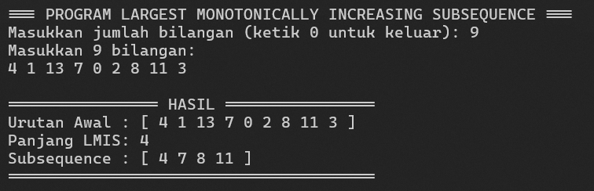
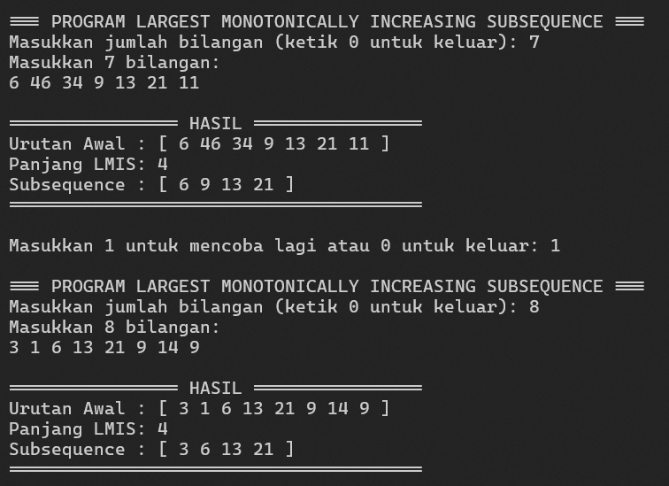

# Praktikum 1 - Mengimplementasikan Program untuk Menyelesaikan Permasalahan “Largest Monotonically Increasing Subsequence” 

|    NRP     |           Nama             |
| :--------: |       :------------:       |
| 5025251055 |   Aga Nafta Filadelfiano   |
| 5025251067 |     Azka Fairus Syamsa     |
| 5025251106 |   Asher Yedijah Hoesono    |

## Largest Monotonically Increasing Subsequence

LMIS merupakan subsequence monotonically increasing dengan jumlah elemen paling banyak. Pada implementasi kali ini, digunakan pendekatan **Dynamic Programming**, dimana Array `dp` digunakan untuk menyimpan panjang subsequence terpanjang yang berakhir pada setiap indeks. Array `parent` digunakan untuk menyimpan indeks elemen sebelumnya sehingga subsequence dapat dibentuk kembali setelah proses perhitungan selesai.


## Algoritma
1. Pengguna memasukkan jumlah bilangan.
2. Pengguna memasukkan seluruh bilangan ke dalam `vector`.
3. Program membuat array `dp` dengan nilai awal `1`.
4. Program membandingkan setiap elemen dengan elemen-elemen sebelumnya.
5. Jika `sequence[i] > sequence[j]`, maka nilai `dp[i]` dapat diperbarui.
6. Array `parent` menyimpan posisi elemen sebelumnya yang digunakan.
7. Program mencari nilai `dp` terbesar.
8. Dari indeks terakhir tersebut, program melakukan rekonstruksi menggunakan `parent`.
9. Hasil rekonstruksi dibalik menggunakan `reverse()`.
10. Program menampilkan sequence awal, panjang LMIS, dan subsequence LMIS.
11. Pengguna dapat memilih untuk mencoba kembali atau keluar dari program.


## Implementasi Program

```cpp
#include <iostream>
#include <vector>
#include <algorithm>

using namespace std;

void findAndPrintLMIS(const vector<int>& sequence) {
    int n = sequence.size();

    vector<int> dp(n, 1);
    vector<int> parent(n, -1);

    int maxLength = 1;
    int endIndex = 0;

    for (int i = 1; i < n; ++i) {
        for (int j = 0; j < i; ++j) {
            if (sequence[i] > sequence[j] && dp[i] < dp[j] + 1) {
                dp[i] = dp[j] + 1;
                parent[i] = j;
            }
        }

        if (dp[i] > maxLength) {
            maxLength = dp[i];
            endIndex = i;
        }
    }

    vector<int> lmis_sequence;
    int curr = endIndex;

    while (curr != -1) {
        lmis_sequence.push_back(sequence[curr]);
        curr = parent[curr];
    }

    reverse(lmis_sequence.begin(), lmis_sequence.end());

    cout << "\n================ HASIL ================\n";

    cout << "Urutan Awal : [ ";
    for (int num : sequence) {
        cout << num << " ";
    }
    cout << "]\n";

    cout << "Panjang LMIS: " << maxLength << "\n";

    cout << "Subsequence : [ ";
    for (int num : lmis_sequence) {
        cout << num << " ";
    }
    cout << "]\n";

    cout << "=======================================\n";
}

int main() {
    int pilihan;

    do {
        int n;

        cout << "\n=== PROGRAM LARGEST MONOTONICALLY INCREASING SUBSEQUENCE ===\n";
        cout << "Masukkan jumlah bilangan (ketik 0 untuk keluar): ";
        cin >> n;

        if (n == 0) {
            cout << "Program selesai, Terima Kasih." << endl;
            return 0;
        }

        if (n < 0) {
            cout << "Jumlah bilangan harus lebih dari 0" << endl;
            continue;
        }

        vector<int> sequence(n);

        cout << "Masukkan " << n << " bilangan:\n";

        for (int i = 0; i < n; ++i) {
            cin >> sequence[i];
        }

        findAndPrintLMIS(sequence);

        cout << "\nMasukkan 1 untuk mencoba lagi atau 0 untuk keluar: ";
        cin >> pilihan;

    } while (pilihan != 0);

    cout << "Program selesai. Terima Kasih." << endl;

    return 0;
}
```

---

## Penjelasan Program

### 1. Library

Program menggunakan tiga library:

```cpp
#include <iostream>
#include <vector>
#include <algorithm>
```

- `iostream` digunakan untuk proses input dan output
- `vector` digunakan untuk menyimpan sequence dan hasil LMIS, sedangkan 
- `algorithm` digunakan untuk fungsi `reverse()`.

### 2. Fungsi `findAndPrintLMIS()`

```cpp
void findAndPrintLMIS(const vector<int>& sequence)
```

Fungsi ini menerima sequence dari pengguna dan melakukan proses pencarian LMIS. Parameter menggunakan `const vector<int>&` agar data tidak perlu disalin dan isi sequence tidak dapat diubah oleh fungsi.

### 3. Array `dp`

```cpp
vector<int> dp(n, 1);
```

Setiap elemen pada awalnya dianggap sebagai subsequence dengan panjang 1. Nilai `dp` kemudian diperbarui berdasarkan elemen-elemen sebelumnya.

### 4. Array `parent`

```cpp
vector<int> parent(n, -1);
```

`parent` digunakan untuk mencatat indeks elemen sebelumnya dalam subsequence. Dengan adanya ini, program dapat mengetahui elemen-elemen yang membentuk LMIS setelah proses Dynamic Programming selesai.

### 5. Proses Dynamic Programming

```cpp
for (int i = 1; i < n; ++i) {
    for (int j = 0; j < i; ++j) {
        if (sequence[i] > sequence[j] && dp[i] < dp[j] + 1) {
            dp[i] = dp[j] + 1;
            parent[i] = j;
        }
    }
}
```

- Program membandingkan `sequence[i]` dengan seluruh elemen sebelumnya `sequence[j]`.

- Jika `sequence[i] > sequence[j]` dan penambahan elemen tersebut menghasilkan subsequence yang lebih panjang, maka nilai `dp[i]` diperbarui.

### 6. Menentukan Panjang Terbesar

```cpp
if (dp[i] > maxLength) {
    maxLength = dp[i];
    endIndex = i;
}
```
Variabel `maxLength` menyimpan panjang LMIS terbesar, sedangkan `endIndex` menyimpan posisi elemen terakhir dari LMIS tersebut.

### 7. Rekonstruksi LMIS

```cpp
while (curr != -1) {
    lmis_sequence.push_back(sequence[curr]);
    curr = parent[curr];
}
```
- Menggunakan `parent` untuk menelusuri elemen dari belakang
- Proses tersebut dilakukan dari elemen terakhir menuju elemen pertama

### 8. Perulangan Program

```cpp
do {
    ...
} while (pilihan != 0);
```
- Program menggunakan `do-while` sehingga pengguna dapat menjalankan pencarian LMIS lebih dari satu kali.
- Pengguna dapat memasukkan `1` untuk mencoba kembali atau `0` untuk keluar.


## Hasil Output Program

### Pengujian 1

**Input:**

```text
Jumlah bilangan : 9
Bilangan        : 4 1 13 7 0 2 8 11 3
```

**Output:**


**Hasil yang diperoleh:**

```text
Urutan Awal : [ 4 1 13 7 0 2 8 11 3 ]
Panjang LMIS: 4
Subsequence : [ 4 7 8 11 ]
```

LMIS yang diperoleh adalah `4 7 8 11` dengan panjang `4`.

### Pengujian 2

**Input:**

```text
Percobaan pertama:
Jumlah bilangan : 7
Bilangan        : 6 46 34 9 13 21 11

Pilih mencoba lagi: 1

Percobaan kedua:
Jumlah bilangan : 8
Bilangan        : 3 1 6 13 21 9 14 9
```

**Output:**


**Hasil yang diperoleh:**

```text
Urutan Awal : [ 6 46 34 9 13 21 11 ]
Panjang LMIS: 4
Subsequence : [ 6 9 13 21 ]
```
LMIS yang diperoleh adalah `6 9 13 21` dengan panjang `4`.

```text
Urutan Awal : [ 3 1 6 13 21 9 14 9 ]
Panjang LMIS: 4
Subsequence : [ 3 6 13 21 ]
```
LMIS yang diperoleh adalah `3 6 13 21` dengan panjang `4`.

### Pengujian 3 - Keluar dari Program

Program diuji menggunakan pilihan `0` untuk memastikan program dapat berhenti dengan benar.

**Output:**


Program menampilkan:

```text
Program selesai. Terima Kasih.
```

## Kesimpulan

Berdasarkan praktikum yang telah dilakukan, dapat disimpulkan bahwa algoritma **Largest Monotonically Increasing Subsequence (LMIS)** dapat diimplementasikan menggunakan pendekatan **Dynamic Programming**.

Program mampu menerima sequence secara langsung dari pengguna, menentukan subsequence monotonically increasing terpanjang, menampilkan panjang LMIS, serta menampilkan elemen-elemen yang membentuk LMIS tersebut.

Penggunaan array `dp` membantu menentukan panjang subsequence pada setiap posisi, sedangkan array `parent` digunakan untuk melakukan rekonstruksi hasil LMIS. Program juga dilengkapi fitur perulangan sehingga pengguna dapat melakukan beberapa pengujian tanpa menjalankan program dari awal.

Kompleksitas waktu algoritma adalah **O(n²)** dengan kompleksitas ruang **O(n)**.
